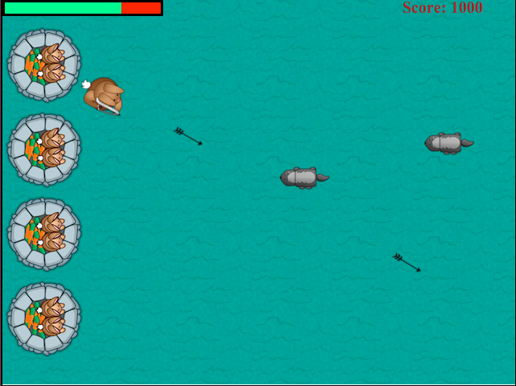

Bunny game
===========================


This is my first private javascipt application and also first simple game. The idea is got from this python [program](http://www.raywenderlich.com/24252/beginning-game-programming-for-teens-with-python) whose developer is just a 13-year-old child. I just want to implement it with javascript techniques I learnt these days.

#Installation
If you want to build the project yourself, you need [npm](https://npmjs.org) and [Grunt](http://gruntjs.com).  Assuming npm is installed, first install Grunt and dependencies like this:

```
> npm install grunt-cli -g
> npm install
```

## Install sass
This task requires you to have Ruby and Sass installed. If you're on OS X or Linux you probably already have Ruby installed; test with ruby -v in your terminal. When you've confirmed you have Ruby installed, run gem install sass to install Sass.

## Build
After install all the libraries, you can build the package like this:

```
> grunt
```

The package will be in the `www` directory which you can copy to your app. Open the page localhost:9000 in the browser, you can see the result.

#How to play
You can use the direction up/left/down/right keys to move the bunny up/left/down/right.

And the bunny will turning according to your mouse, then to shoot, you can left click the mouse.

#Release
To release the desktop application, type the command:
```
 grunt release
```
Then go to the folder webkitbuilds/releases/nodewebkitapp/{yoursystem}/nodewebkitapp and execute the nodewebkitapp file

#Libaries

##Set up
Npm, grunt, Browserify, mocha, chai, handlebars, sass,

##Develop
Jquery, lodash, lazyjs

##Release
node-webkit

#Tools
Vim (you can also check my vim configuration [myvim](https://github.com/xfsnowind/myvim))

#TODOS
* Add sounds
* Update the images when bunny shoots, arrows and mice move
* Apply canvas in the new version
